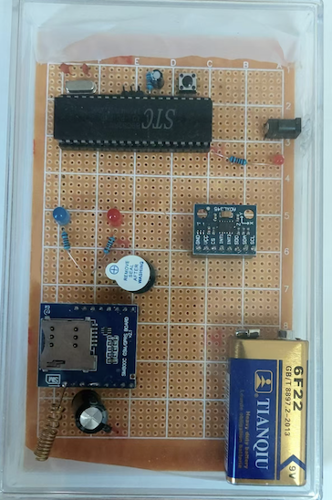
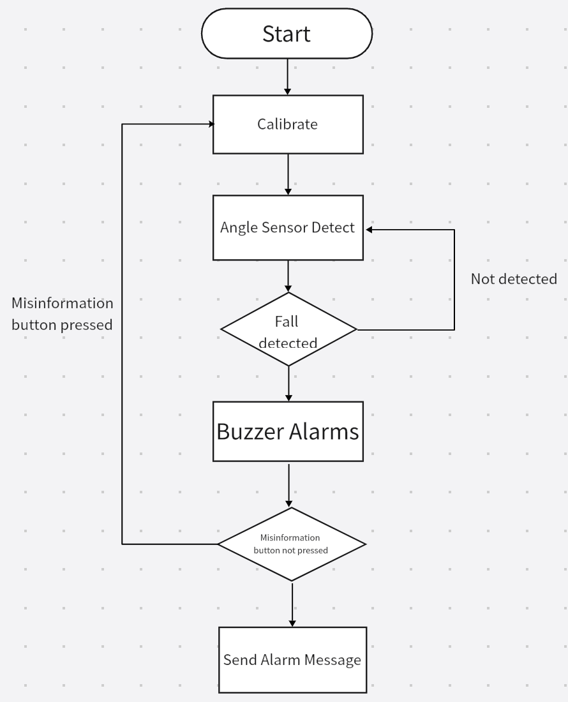
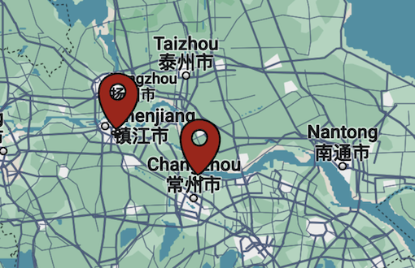

# Descriptions here for outdoor fall-detection device

Version 1.0
 
    

Version 2.0
###### The fundamental appearance remains unchanged, while the improvements to the device mainly include the following aspects:

- ###### A protective plastic pad has been added to the rear side of the circuit board to prevent impacts and safeguard the rear circuitry.
- ######  The initial placement position of Version1.0 has been eliminated; detection will now be based on the position after power activation (thus enhancing usability).

- ######  The delay in sending alarm notifications has been canceled, allowing for immediate alarming message sending. The cancellation button is now solely designated for silencing the buzzer alarm and restarting the program.

---

How to use? or other infos? see here!
#### [Instruction Link! Click here!](https://esperaa.github.io/WebextensionforAutome-/)

---

#### Running Flow Chart 
 
---

Changes are made on software of the device, based on the fbs from users.
Changes include: 

##### -Questionaire Data
###### the first investigation

These are data collected from investigation papers. Hundreds of pepole (age 18-80) filled the questionaire. According to the data I made a conclusion for ⬇️

##### -The aspects that I will inculded in my first version
- The device should be small and portable 
- It should have high precision
- It cannot affect users' privacy
- It should be safe
- It should be easy to use
  
---
###### the second investigation
These are data collected from investigation papers. Users filled the questionaire2. According to the data I made a conclusion for ⬇

##### -The aspects that I will inculded in my second version
- More physical protections to the device, which will make it more durable
- With initial calibration of the position in angle sensor,
  which will make the device more flexible, without starting
  with a specific angle.
- 5 second waiting time for sending emergency message after the detection is canceled
#### Helping Map

##### Currently, 27 elderly & young kids in 2 cities (ChangZhou/ZhengJiang) have received the device //Update time: 03/08/2024
---
##### Feedbacks
Want to tell me something about the product?/ Want to have one?
###### 👉email to: Fall_detectemail@qq.com
---

##### Renovations

-Questionaire link 1: For viewpoints on designing this device
###### ➡️[Click here to do the questionaire!](https://v.wjx.cn/vm/Q2Frjo2.aspx#)📝

-Questionaire link2: For users who used the first generation

---
[Homepage Link](esperaa.github.io/meaidevice/)

